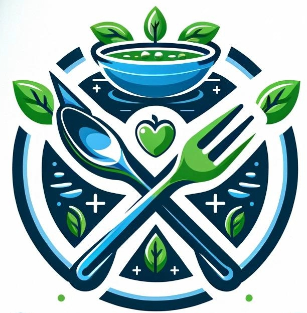

<a name="readme-top"></a>

<!-- PROJECT SHIELDS -->
<!--
*** I'm using markdown "reference style" links for readability.
*** Reference links are enclosed in brackets [ ] instead of parentheses ( ).
*** See the bottom of this document for the declaration of the reference variables
*** for contributors-url, forks-url, etc. This is an optional, concise syntax you may use.
*** https://www.markdownguide.org/basic-syntax/#reference-style-links
-->

Maryia Kunkel [![LinkedIn][linkedin-shield]][linkedin-url]

<!-- PROJECT LOGO -->
<br />
<div align="center">
  <a href="https://github.com/MaryiaKunkel/nourish_pal/">
    
  </a>

<h3 align="center">NourishPal</h3>

  <p align="center">
    NourishPal is a feature-rich recipe website designed to cater to all your culinary needs. Whether you're following a specific diet, dealing with food intolerances, or looking for recipes with particular ingredients, NourishPal has you covered. Take control of your cooking experience by customizing searches based on dietary preferences, excluding specific ingredients, or selecting recipes with your preferred cooking time. 
    <!-- <br /> -->
    <!-- <a href="https://github.com/github_username/repo_name"><strong>Explore the docs »</strong></a> -->
    <!-- <br />
    <br />
    <a href="https://github.com/github_username/repo_name">View Demo</a>
    ·
    <a href="https://github.com/github_username/repo_name/issues">Report Bug</a>
    ·
    <a href="https://github.com/github_username/repo_name/issues">Request Feature</a> -->
  </p>
</div>

<!-- TABLE OF CONTENTS -->
<details>
  <summary>Table of Contents</summary>
  <ol>
    <li>
      <a href="#about-the-project">About The Project</a>
      <ul>
        <li><a href="#built-with">Built With</a></li>
      </ul>
    </li>
    <li>
      <a href="#getting-started">Getting Started</a>
      <ul>
        <li><a href="#prerequisites">Prerequisites</a></li>
        <li><a href="#installation">Installation</a></li>
      </ul>
    </li>
    <li><a href="#usage">Usage</a></li>
    <li><a href="#roadmap">Roadmap</a></li>
    <li><a href="#contact">Contact</a></li>
  </ol>
</details>

<!-- ABOUT THE PROJECT -->

## About The Project

[](https://github.com/MaryiaKunkel/nourish_pal/blob/nourishpal/home_page.png)

<!-- Here's a blank template to get started: To avoid retyping too much info. Do a search and replace with your text editor for the following: `github_username`, `repo_name`, `twitter_handle`, `linkedin_username`, `email_client`, `email`, `project_title`, `project_description` -->

<p align="right">(<a href="#readme-top">back to top</a>)</p>

### Built With

- [![Python][Python-img]][Python-url]
- [![JavaScript]][][JavaScript-url]
- [![HTML]][][HTML-url]
- [![CSS]][][CSS-url]
- [![Flask][Flask-img]][][Flask-url]
- [![fontawesome]][fontawesome-url]
- [![PostgreSQL][PostgreSQL-img]][PostgreSQL-url]
- [![Django]][Django-url]
- [![Bootstrap][Bootstrap-img]][Bootstrap-url]
- [![JQuery][JQuery-img]][JQuery-url]

<p align="right">(<a href="#readme-top">back to top</a>)</p>

<!-- GETTING STARTED -->

## Getting Started

This is the instructions on setting up the project locally.
To get a local copy up and running follow these simple steps.

### Prerequisites

- Python

  ```sh
  # Install or update Python to the latest version
  sudo apt-get update
  sudo apt-get install python3
  ```

- Flask

  ```sh
  # Install Flask using pip
  pip install Flask
  ```

- PostgreSQL
  ```sh
  # Install PostgreSQL
  sudo apt-get install postgresql
  ```

### Installation

1. Get a free API Key at [spoonacular.com](https://spoonacular.com/food-api) or you can use my API that is in .gitignore.
2. Clone the repo
   ```sh
   git clone https://github.com/MaryiaKunkel/nourish_pal.git
   ```
3. Install Python packages
   ```sh
   pip install -r requirements.txt
   ```
4. Set up your PostgreSQL database
   ```
   # Follow instructions to create and configure your PostgreSQL database
   ```
5. If you decide to use your own API key, enter the key in mysecrets.py

```python
API_KEY = 'ENTER YOUR API';
```

<p align="right">(<a href="#readme-top">back to top</a>)</p>

<!-- USAGE EXAMPLES -->

## Usage

- [ ] Use advanced search to find the recipe that meets your requirements.
    [![Product Name Screen Shot][advanced_search_1]]
<!-- Use this space to show useful examples of how a project can be used. Additional screenshots, code examples and demos work well in this space. You may also link to more resources. -->

<!-- _For more examples, please refer to the [Documentation](https://example.com)_ -->

<p align="right">(<a href="#readme-top">back to top</a>)</p>

<!-- ROADMAP -->

## Roadmap

- [ ] Explore New Recipes. Browse through a vast collection of recipes from various cuisines. Click on any recipe to view detailed instructions, ingredients, nutritional information, and more.
- [ ] Save Your Favorites. Found a recipe you love? Click the bookmark icon to save it to your favorites. Access your favorite recipes anytime from the "Favorites" section in your profile or in the navbar.
- [ ] Keep Track of Your History. NourishPal automatically tracks your recipe history. Revisit recipes you've tried before, and easily replicate your culinary successes.
- [ ] Personalized Profile. Update your profile, track your cooking journey, and manage your saved recipes. Your personalized profile makes the NourishPal experience uniquely yours.
- [ ] Clear Recipe History. Want to start fresh? Use the "Clear History" feature to reset your recipe history and embark on new culinary adventures.

<!-- See the [open issues](https://github.com/github_username/repo_name/issues) for a full list of proposed features (and known issues). -->

<p align="right">(<a href="#readme-top">back to top</a>)</p>

<!-- CONTRIBUTING -->

<!-- ## Contributing

Contributions are what make the open source community such an amazing place to learn, inspire, and create. Any contributions you make are **greatly appreciated**.

If you have a suggestion that would make this better, please fork the repo and create a pull request. You can also simply open an issue with the tag "enhancement".
Don't forget to give the project a star! Thanks again!

1. Fork the Project
2. Create your Feature Branch (`git checkout -b feature/AmazingFeature`)
3. Commit your Changes (`git commit -m 'Add some AmazingFeature'`)
4. Push to the Branch (`git push origin feature/AmazingFeature`)
5. Open a Pull Request -->

<!-- <p align="right">(<a href="#readme-top">back to top</a>)</p> -->

<!-- LICENSE -->

<!-- ## License

Distributed under the MIT License. See `LICENSE.txt` for more information.

<p align="right">(<a href="#readme-top">back to top</a>)</p> -->

<!-- CONTACT -->

## Contact

Maryia Kunkel - [![LinkedIn][linkedin-url]] - maryiakunkel@gmail.com

Project Link: [https://github.com/MaryiaKunkel/nourish_pal/](https://github.com/MaryiaKunkel/nourish_pal/)

<p align="right">(<a href="#readme-top">back to top</a>)</p>

<!-- ACKNOWLEDGMENTS -->

<!-- ## Acknowledgments

- []()
- []()
- []()

<p align="right">(<a href="#readme-top">back to top</a>)</p> -->

<!-- MARKDOWN LINKS & IMAGES -->

[linkedin-shield]: https://img.shields.io/badge/-LinkedIn-black.svg?style=for-the-badge&logo=linkedin&colorB=555
[linkedin-url]: https://www.linkedin.com/in/maryia-kunkel/
[product-screenshot]: static/logo.jpg
[Bootstrap-url]: https://getbootstrap.com
[Bootstrap Badge]: https://img.shields.io/badge/Bootstrap-563D7C?style=for-the-badge&logo=bootstrap&logoColor=white
[JQuery-url]: https://jquery.com
[JQuery Badge]: https://img.shields.io/badge/jQuery-0769AD?style=for-the-badge&logo=jquery&logoColor=white
[Python-url]: https://www.python.org/
[Python Badge]: https://img.shields.io/badge/Python-3776AB?style=for-the-badge&logo=python&logoColor=white
[JavaScript-url]: https://developer.mozilla.org/en-US/docs/Web/JavaScript
[JavaScript Badge]: https://img.shields.io/badge/JavaScript-F7DF1E?style=for-the-badge&logo=javascript&logoColor=black
[HTML-url]: https://developer.mozilla.org/en-US/docs/Web/HTML
[HTML Badge]: https://img.shields.io/badge/HTML5-E34F26?style=for-the-badge&logo=html5&logoColor=white
[CSS-url]: https://developer.mozilla.org/en-US/docs/Web/CSS
[CSS Badge]: https://img.shields.io/badge/CSS3-1572B6?style=for-the-badge&logo=css3&logoColor=white
[Flask-url]: https://flask.palletsprojects.com/
[Flask Badge]: https://flask.palletsprojects.com/en/3.0.x/_images/flask-horizontal.png
[fontawesome-url]: https://fontawesome.com/
[FontAwesome Badge]: https://img.shields.io/badge/FontAwesome-339AF0?style=for-the-badge&logo=font-awesome&logoColor=white
[PostgreSQL-url]: https://www.postgresql.org/
[PostgreSQL Badge]: https://img.shields.io/badge/PostgreSQL-4169E1?style=for-the-badge&logo=postgresql&logoColor=white
[Django-url]: https://www.djangoproject.com/
[Django Badge]: https://img.shields.io/badge/Django-092E20?style=for-the-badge&logo=django&logoColor=white
[product-screenshot]: https://github.com/MaryiaKunkel/nourish_pal/blob/nourishpal/home_page.png
[advanced_search_1]: https://github.com/MaryiaKunkel/nourish_pal/blob/nourishpal/advanced_search_1.png
[advanced_search_2]: https://github.com/MaryiaKunkel/nourish_pal/blob/nourishpal/advanced_search_2.png
[advanced_search_results]: https://github.com/MaryiaKunkel/nourish_pal/blob/nourishpal/advanced_search_results.png
[favorites]: https://github.com/MaryiaKunkel/nourish_pal/blob/nourishpal/favorites.png
[profile]: https://github.com/MaryiaKunkel/nourish_pal/blob/nourishpal/profile.png
[profile_edit]: https://github.com/MaryiaKunkel/nourish_pal/blob/nourishpal/profile_edit.png
[recipe_page_1]: https://github.com/MaryiaKunkel/nourish_pal/blob/nourishpal/recipe_page_1.png
[recipe_page_2]: https://github.com/MaryiaKunkel/nourish_pal/blob/nourishpal/recipe_page_2.png
